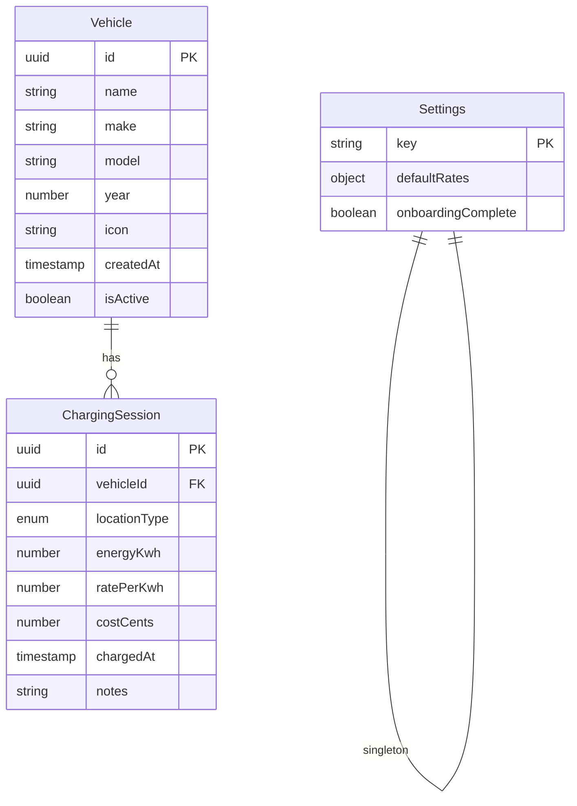
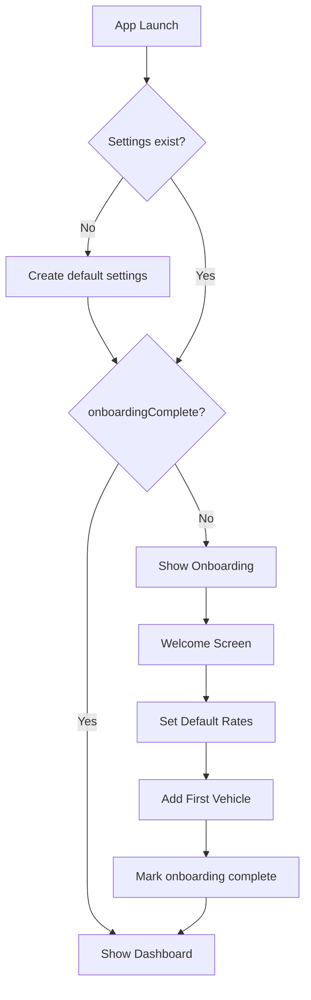
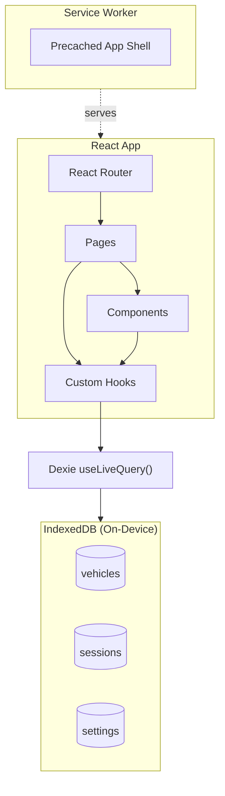

# EV Charge Tracker - Technical Architecture v3

## Overview

A fully offline PWA for tracking EV charging sessions. Designed to function as a native-like app without app store distribution, with all data stored locally on-device.

## Technology Stack

### Core
- **Vite** - Build tool and dev server
- **React 19** - UI framework
- **TypeScript** - Type safety
- **Dexie.js** - IndexedDB wrapper with React hooks
- **Vite PWA Plugin** - Service worker generation

### UI & Styling
- **Tailwind CSS** - Utility-first CSS framework (bundled via PostCSS)

### Additional
- **Recharts** - Chart components
- **React Router** - Client-side routing
- **date-fns** - Date utilities

## Architecture Principles

### Offline-First Design
```
NO_NETWORK_REQUIRED:
  - All features work without internet connection
  - No backend API, no cloud sync
  - Data never leaves the device
  - Network only needed for initial app download/updates

STORAGE_STRATEGY:
  - IndexedDB for all persistent data
  - Request persistent storage to survive browser cleanup
  - Warn user if storage quota is low
```

### PWA as App Store Alternative
```
DISTRIBUTION:
  - Host on any static hosting (Vercel, Netlify, GitHub Pages)
  - Users install directly from browser
  - Auto-updates via service worker
  - No app store review process
  - No platform fees
```

---

## Data Model

### Entity Relationships



### Entities

```
Vehicle
  - id: uuid
  - name: string (user-friendly label, e.g., "Daily Driver")
  - make: string? (e.g., "Tesla")
  - model: string? (e.g., "Model 3")
  - year: number? (e.g., 2023)
  - icon: string (emoji, default "🚗")
  - createdAt: timestamp
  - isActive: boolean (soft delete)

ChargingSession
  - id: uuid
  - vehicleId: uuid (FK)
  - locationType: enum[HOME, WORK, OTHER, DC]
  - energyKwh: number
  - ratePerKwh: number
  - costCents: number (computed at creation, stored permanently)
  - chargedAt: timestamp
  - notes: string?

Settings
  - key: 'app-settings' (singleton)
  - defaultRates: {
      HOME: number,
      WORK: number,
      OTHER: number,
      DC: number
    }
  - onboardingComplete: boolean
```

### Location Type Display Map
```
LOCATION_TYPES = {
  HOME:  { key: 'HOME',  label: 'Home',  icon: '🏠', color: 'blue' },
  WORK:  { key: 'WORK',  label: 'Work',  icon: '🏢', color: 'purple' },
  OTHER: { key: 'OTHER', label: 'Other', icon: '📍', color: 'pink' },
  DC:    { key: 'DC',    label: 'DC',    icon: 'âš¡', color: 'amber' }
}
```

### Database Schema
```
STORE: vehicles
  INDEX: id (primary)
  INDEX: isActive
  INDEX: createdAt

STORE: sessions
  INDEX: id (primary)
  INDEX: vehicleId
  INDEX: chargedAt
  INDEX: [vehicleId, chargedAt] (compound)

STORE: settings
  INDEX: key (primary)
```

---

## First Launch & Onboarding

### App Initialization Flow



### Default Settings Initialization
```
ON_FIRST_LAUNCH:
  CREATE settings {
    key: 'app-settings',
    defaultRates: {
      HOME: 0.12,
      WORK: 0.00,
      OTHER: 0.15,
      DC: 0.35
    },
    onboardingComplete: false
  }
```

### Onboarding Screens
```
SCREEN 1: Welcome
  - App name and purpose
  - "Get Started" button

SCREEN 2: Default Rates
  - Pre-filled with common defaults
  - Explain these can be changed later
  - "Next" button

SCREEN 3: First Vehicle
  - Required: name
  - Optional: make, model, year
  - Icon picker (emoji grid)
  - "Add Vehicle" → mark onboarding complete → go to Dashboard
```

### Empty States (Post-Onboarding)
```
DASHBOARD_EMPTY:
  When: 0 sessions exist
  Show: "No charging sessions yet"
  Action: "Log your first charge" → Add Session

SESSIONS_LIST_EMPTY:
  When: 0 sessions match filters
  Show: "No sessions found"
  Action: Suggest clearing filters or adding session

VEHICLES_EMPTY:
  When: 0 active vehicles (edge case after deletion)
  Show: "Add a vehicle to start tracking"
  Action: "Add Vehicle" button
```

---

## PWA Configuration

### Installation & Icons

```
ICON_SIZES:
  - 192x192 (Android home screen)
  - 512x512 (Android splash, PWA install)
  - 180x180 (iOS touch icon)
  - 32x32, 16x16 (favicon)

MANIFEST:
  name: "EV Charge Tracker"
  short_name: "Charge Tracker"
  description: "Track your EV charging sessions offline"
  start_url: "/"
  display: "standalone"
  background_color: "#ffffff"
  theme_color: "#2563eb" (blue-600)
  icons: [see sizes above]
```

### Service Worker Strategy
```
PRECACHE (install time):
  - index.html
  - All JS/CSS bundles
  - App icons
  - Fonts (if any)

RUNTIME:
  - No network requests needed
  - All functionality offline

UPDATE_FLOW:
  ON new service worker detected:
    Show unobtrusive "Update available" indicator
    ON user action OR next app launch:
      Activate new service worker
      Reload app
```

### Persistent Storage
```
ON_APP_INIT:
  if navigator.storage.persist:
    granted = await navigator.storage.persist()
    if not granted:
      // Browser may still evict data under storage pressure
      // Continue normally, most browsers won't evict active PWAs

ON_SETTINGS_PAGE:
  estimate = await navigator.storage.estimate()
  Display: "{used} of {quota} used"
```

---

## High-Level Architecture



## Routing Structure
```
/                    → Dashboard (redirects to /onboarding if needed)
/onboarding          → Onboarding flow (3 steps)
/sessions            → SessionsList
/sessions/add        → SessionForm (create)
/sessions/:id/edit   → SessionForm (edit)
/vehicles            → VehiclesList  
/vehicles/add        → VehicleForm (create)
/vehicles/:id/edit   → VehicleForm (edit)
/settings            → Settings
```

## Data Access Pattern

### Custom Hooks
```
useAppReady() {
  settings = useLiveQuery(GET settings)
  
  return {
    isLoading: settings === undefined,
    needsOnboarding: settings?.onboardingComplete === false,
    settings
  }
}

useVehicles(activeOnly?) {
  return {
    vehicles: REACTIVE from IndexedDB,
    createVehicle(data),
    updateVehicle(id, data),
    deleteVehicle(id) // only if no sessions
  }
}

useSessions(filters?) {
  // filters: { vehicleId?, locationType?, dateRange? }
  return {
    sessions: REACTIVE from IndexedDB,
    createSession(data),
    updateSession(id, data),
    deleteSession(id)
  }
}

useSettings() {
  return {
    settings: REACTIVE from IndexedDB,
    updateSettings(data),
    completeOnboarding()
  }
}

useStats(vehicleId?, dateRange?) {
  // Computed from sessions
  return {
    totalKwh,
    totalCostCents,
    avgRatePerKwh,
    byLocation: { HOME: kwh, WORK: kwh, ... },
    byDate: [{ date, HOME, WORK, OTHER, DC }, ...]
  }
}
```

---

## Business Logic

### Cost Calculation
```
ON_SESSION_CREATE:
  costCents = ROUND(energyKwh × ratePerKwh × 100)
  // Stored permanently, never recalculated
  // Changing default rates does NOT affect existing sessions
```

### Vehicle Deletion
```
ON_DELETE_VEHICLE:
  sessionCount = COUNT sessions WHERE vehicleId = id
  
  if sessionCount > 0:
    SHOW error "Cannot delete vehicle with existing sessions"
    OFFER "Delete all sessions first?" (dangerous action)
  else:
    DELETE vehicle
```

### Default Rate Application
```
ON_ADD_SESSION:
  locationType selected → pre-fill rate from settings.defaultRates[type]
  User can override rate for this session
  "Use default rate" checkbox controls whether rate field is editable
```

---

## Development Setup

### Create Project
```bash
npm create vite@latest ev-charge-tracker -- --template react-ts
cd ev-charge-tracker

npm install dexie dexie-react-hooks
npm install react-router-dom recharts date-fns

npm install -D tailwindcss postcss autoprefixer
npx tailwindcss init -p

npm install -D vite-plugin-pwa
```

### File Structure
```
src/
  components/      # Reusable UI components
  hooks/           # useVehicles, useSessions, useSettings, useStats
  lib/
    db.ts          # Dexie database setup
    constants.ts   # Location types, defaults
  pages/           # Route components
  types/           # TypeScript interfaces
public/
  icons/           # PWA icons (192, 512, etc.)
  favicon.ico
```

### Deployment
```
BUILD:
  Vite bundles app
  PWA plugin generates service worker + manifest

DEPLOY:
  Any static host (Vercel, Netlify, GitHub Pages)
  Must be served over HTTPS for PWA features

USER_INSTALL:
  Visit URL in browser
  Browser shows "Install" prompt (or use menu)
  App added to home screen / app launcher
```

---

## Key Design Decisions

| Decision                   | Rationale                                           |
| -------------------------- | --------------------------------------------------- |
| Offline-only               | Privacy, no backend costs, instant performance      |
| IndexedDB via Dexie        | Reactive queries, good DX, handles large datasets   |
| Cost stored as cents       | Avoid floating point math issues                    |
| Cost never recalculates    | Historical accuracy (learned from Tesla's mistakes) |
| Soft delete for vehicles   | Preserve session history integrity                  |
| Emoji for vehicle icons    | Universal, no asset management, user-friendly       |
| Onboarding flow            | Ensure valid state before main app usage            |
| Persistent storage request | Reduce chance of data loss                          |