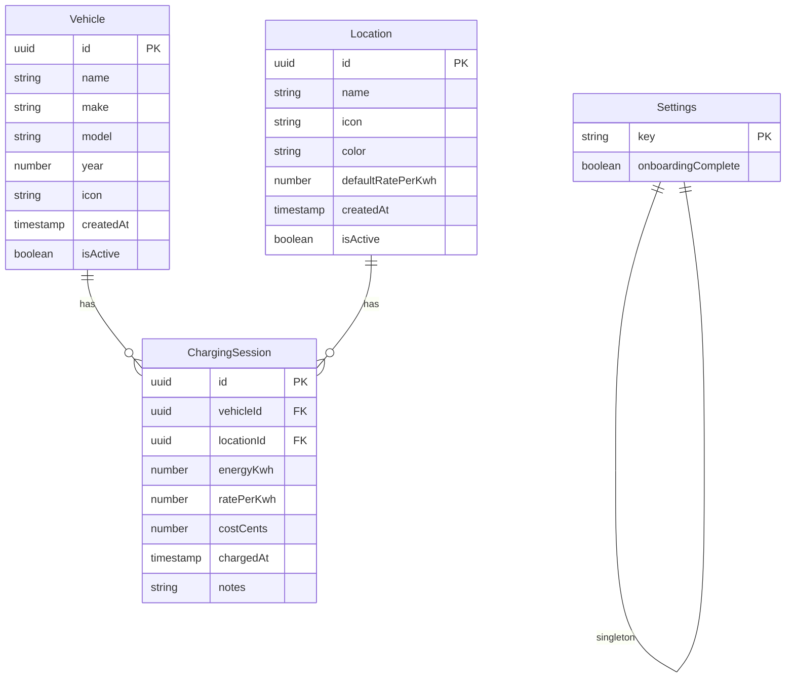
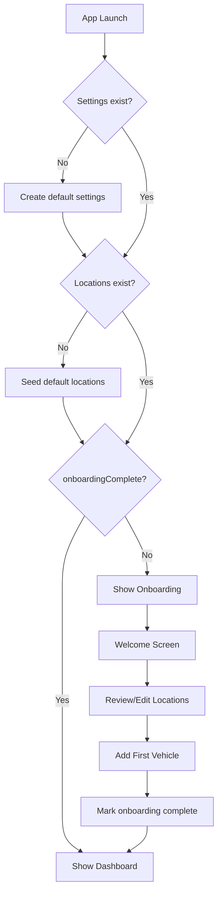
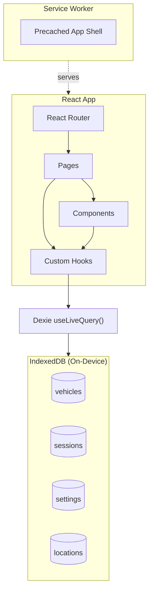

# EV Charge Tracker - Technical Architecture v3

## Overview

A fully offline PWA for tracking EV charging sessions. Designed to function as a native-like app without app store distribution, with all data stored locally on-device.

## Technology Stack

### Core
- **Vite** - Build tool and dev server
- **React 19** - UI framework
- **TypeScript** - Type safety
- **Dexie.js** - IndexedDB wrapper with React hooks
- **Vite PWA Plugin** - Service worker generation

### UI & Styling
- **Tailwind CSS** - Utility-first CSS framework (bundled via PostCSS)

### Additional
- **Lucide React** - Tree-shakeable SVG icon components
- **Recharts** - Chart components
- **React Router** - Client-side routing
- **date-fns** - Date utilities

## Architecture Principles

### Offline-First Design
```
NO_NETWORK_REQUIRED:
  - All features work without internet connection
  - No backend API, no cloud sync
  - Data never leaves the device
  - Network only needed for initial app download/updates

STORAGE_STRATEGY:
  - IndexedDB for all persistent data
  - Request persistent storage to survive browser cleanup
  - Warn user if storage quota is low
```

### PWA as App Store Alternative
```
DISTRIBUTION:
  - Host on any static hosting (Vercel, Netlify, GitHub Pages)
  - Users install directly from browser
  - Auto-updates via service worker
  - No app store review process
  - No platform fees
```

---

## Data Model

### Entity Relationships



### Entities

```
Vehicle
  - id: uuid
  - name: string (user-friendly label, e.g., "Daily Driver")
  - make: string? (e.g., "Tesla")
  - model: string? (e.g., "Model 3")
  - year: number? (e.g., 2023)
  - icon: IconName (Lucide icon identifier, default "car")
  - createdAt: timestamp
  - isActive: boolean (soft delete)

ChargingSession
  - id: uuid
  - vehicleId: uuid (FK)
  - locationType: enum[HOME, WORK, OTHER, DC]
  - energyKwh: number
  - ratePerKwh: number
  - costCents: number (computed at creation, stored permanently)
  - chargedAt: timestamp
  - notes: string?

Settings
  - key: 'app-settings' (singleton)
  - defaultRates: {
      HOME: number,
      WORK: number,
      OTHER: number,
      DC: number
    }
  - onboardingComplete: boolean
```

### Default Locations
```
DEFAULT_LOCATIONS = [
  { name: 'Home',    icon: 'home',     color: 'blue',   defaultRate: 0.12 },
  { name: 'Work',    icon: 'building', color: 'purple', defaultRate: 0.0 },
  { name: 'Other',   icon: 'map-pin',  color: 'pink',   defaultRate: 0.15 },
  { name: 'DC Fast', icon: 'zap',      color: 'amber',  defaultRate: 0.35 }
]

// Seeded on first launch, user can add/edit/delete
// Deletion prevented if sessions reference the location
```

### Database Schema
```
STORE: vehicles
  INDEX: id (primary)
  INDEX: isActive
  INDEX: createdAt

STORE: locations
  INDEX: id (primary)
  INDEX: isActive
  INDEX: createdAt

STORE: sessions
  INDEX: id (primary)
  INDEX: vehicleId
  INDEX: locationId
  INDEX: chargedAt
  INDEX: [vehicleId, chargedAt] (compound)

STORE: settings
  INDEX: key (primary)
```

---

## First Launch & Onboarding

### App Initialization Flow



### Default Settings Initialization
```
ON_FIRST_LAUNCH:
  CREATE settings {
    key: 'app-settings',
    onboardingComplete: false
  }
  
  SEED locations [
    { name: 'Home',    icon: 'home',     color: 'blue',   defaultRate: 0.15 },
    { name: 'Work',    icon: 'building', color: 'purple', defaultRate: 0.17 },
    { name: 'Other',   icon: 'map-pin',  color: 'pink',   defaultRate: 0.11 },
    { name: 'DC Fast', icon: 'zap',      color: 'amber',  defaultRate: 0.35 }
  ]
```

### Onboarding Screens
```
SCREEN 1: Welcome
  - App name and purpose
  - "Get Started" button

SCREEN 2: Review/Edit Locations
  - Show 4 seeded default locations
  - Allow edit (name, icon, color, rate)
  - Allow add new locations
  - Explain these can be changed later in Settings
  - "Next" button

SCREEN 3: First Vehicle
  - Required: name
  - Optional: make, model, year
  - Icon picker (Lucide icon grid)
  - "Add Vehicle" → mark onboarding complete → go to Dashboard
```

### Empty States (Post-Onboarding)
```
DASHBOARD_EMPTY:
  When: 0 sessions exist
  Show: "No charging sessions yet"
  Action: "Log your first charge" → Add Session

SESSIONS_LIST_EMPTY:
  When: 0 sessions match filters
  Show: "No sessions found"
  Action: Suggest clearing filters or adding session

VEHICLES_EMPTY:
  When: 0 active vehicles (edge case after deletion)
  Show: "Add a vehicle to start tracking"
  Action: "Add Vehicle" button
```

---

## PWA Configuration

### Installation & Icons

```
ICON_SIZES:
  - 192x192 (Android home screen)
  - 512x512 (Android splash, PWA install)
  - 180x180 (iOS touch icon)
  - 32x32, 16x16 (favicon)

MANIFEST:
  name: "EV Charge Tracker"
  short_name: "Charge Tracker"
  description: "Track your EV charging sessions offline"
  start_url: "/"
  display: "standalone"
  background_color: "#ffffff"
  theme_color: "#2563eb" (blue-600)
  icons: [see sizes above]
```

### Service Worker Strategy
```
PRECACHE (install time):
  - index.html
  - All JS/CSS bundles
  - App icons
  - Fonts (if any)

RUNTIME:
  - No network requests needed
  - All functionality offline

UPDATE_FLOW:
  ON new service worker detected:
    Show unobtrusive "Update available" indicator
    ON user action OR next app launch:
      Activate new service worker
      Reload app
```

### Persistent Storage
```
ON_APP_INIT:
  if navigator.storage.persist:
    granted = await navigator.storage.persist()
    if not granted:
      // Browser may still evict data under storage pressure
      // Continue normally, most browsers won't evict active PWAs

ON_SETTINGS_PAGE:
  estimate = await navigator.storage.estimate()
  Display: "{used} of {quota} used"
```

---

## High-Level Architecture



## Routing Structure
```
/                    # Dashboard (redirects to /onboarding if needed)
/onboarding          # Onboarding flow (3 steps)
/sessions            # SessionsList
/sessions/add        # SessionForm (create)
/sessions/:id/edit   # SessionForm (edit)
/vehicles            # VehiclesList  
/vehicles/add        # VehicleForm (create)
/vehicles/:id/edit   # VehicleForm (edit)
/settings            # Settings
```

## Data Access Pattern

### Context Providers

```
DatabaseProvider
  - Provides: db (Dexie instance)
  - Used by: All hooks and AppInitializationProvider
  - Why: Single source of truth, prevents multiple Dexie instances

AppInitializationProvider
  - Provides: isLoading, needsOnboarding, settings
  - Uses: DatabaseProvider's db
  - Handles on mount:
    * Create default settings if none exist
    * Seed default locations if none exist
    * Request persistent storage (navigator.storage.persist)
  - Why: Centralized initialization, runs once at app root

App Structure:
  <DatabaseProvider>
    <AppInitializationProvider>
      <Router />
    </AppInitializationProvider>
  </DatabaseProvider>
```

### Custom Hooks
```
useDatabase() {
  // Access db from DatabaseContext
  return { db }
}

useAppInitialization() {
  // Access initialization state from AppInitializationContext
  return { isLoading, needsOnboarding, settings }
}

useVehicles(activeOnly?) {
  db = useDatabase()
  return {
    vehicles: REACTIVE from IndexedDB,
    createVehicle(data),
    updateVehicle(id, data),
    deleteVehicle(id) // only if no sessions
  }
}

useLocations(activeOnly?) {
  db = useDatabase()
  return {
    locations: REACTIVE from IndexedDB,
    createLocation(data),
    updateLocation(id, data),
    deleteLocation(id) // only if no sessions
  }
}

useSessions(filters?) {
  // filters: { vehicleId?, locationId?, dateRange? }
  db = useDatabase()
  return {
    sessions: REACTIVE from IndexedDB,
    createSession(data),
    updateSession(id, data),
    deleteSession(id)
  }
}

useSettings() {
  db = useDatabase()
  return {
    settings: REACTIVE from IndexedDB,
    updateSettings(data),
    completeOnboarding()
  }
}

useStats(filters?) {
  // filters: { vehicleId?, locationId?, dateRange? }
  // Computed from sessions
  db = useDatabase()
  return {
    totalKwh,
    totalCostCents,
    avgRatePerKwh,
    byLocation: { [locationId]: { name, kwh, cost }, ... },
    byDate: [{ date, [locationId]: kwh }, ...]
  }
}
```

---

## Business Logic

### Cost Calculation
```
ON_SESSION_CREATE:
  costCents = ROUND(energyKwh × ratePerKwh × 100)
  // Stored permanently, never recalculated
  // Changing default rates does NOT affect existing sessions
```

### Vehicle Deletion
```
ON_DELETE_VEHICLE:
  sessionCount = COUNT sessions WHERE vehicleId = id
  
  if sessionCount > 0:
    SHOW error "Cannot delete vehicle with existing sessions"
    OFFER "Delete all sessions first?" (dangerous action)
  else:
    DELETE vehicle
```

### Location Deletion
```
ON_DELETE_LOCATION:
  sessionCount = COUNT sessions WHERE locationId = id
  
  if sessionCount > 0:
    SHOW error "Cannot delete location with existing sessions"
  else:
    SET location.isActive = false (soft delete)
```

### Default Rate Application
```
ON_ADD_SESSION:
  location selected → pre-fill rate from location.defaultRate
  User can override rate for this session
  "Use default rate" checkbox controls whether rate field is editable
```

---

## Development Setup

### Create Project
```bash
npm create vite@latest ev-charge-tracker -- --template react-ts
cd ev-charge-tracker

npm install dexie dexie-react-hooks
npm install react-router-dom recharts date-fns

npm install -D tailwindcss postcss autoprefixer
npx tailwindcss init -p

npm install -D vite-plugin-pwa
```

### File Structure
```
src/
  components/      # Reusable UI components
  contexts/        # DatabaseProvider, AppInitializationProvider
  hooks/           # useVehicles, useSessions, useSettings, useLocations, useStats
  data/            # db.ts, data-types.ts, constants.ts, utils.ts
  pages/           # Route components
public/
  icons/           # PWA icons (192, 512, etc.)
  favicon.ico
```

### Deployment
```
BUILD:
  Vite bundles app
  PWA plugin generates service worker + manifest

DEPLOY:
  Any free static host (Vercel, Netlify, GitHub Pages)
  Must be served over HTTPS for PWA features

USER_INSTALL:
  Visit URL in browser
  Browser shows "Install" prompt (or use menu)
  App added to home screen / app launcher
```

---

## Key Design Decisions

| Decision                   | Rationale                                            |
| -------------------------- | ---------------------------------------------------- |
| Offline-only               | Privacy, no backend costs, instant performance       |
| IndexedDB via Dexie        | Reactive queries, good DX, handles large datasets    |
| Cost stored as cents       | Avoid floating point math issues                     |
| Cost never recalculates    | Historical accuracy (learned from Tesla's mistakes)  |
| Soft delete for vehicles   | Preserve session history integrity                   |
| Soft delete for locations  | Preserve session history integrity                   |
| Dynamic location store     | User can customize locations, rates, add new ones    |
| Lucide icons               | Tree-shakeable SVG, consistent rendering, accessible |
| Onboarding flow            | Ensure valid state before main app usage             |
| Persistent storage request | Reduce chance of data loss                           |