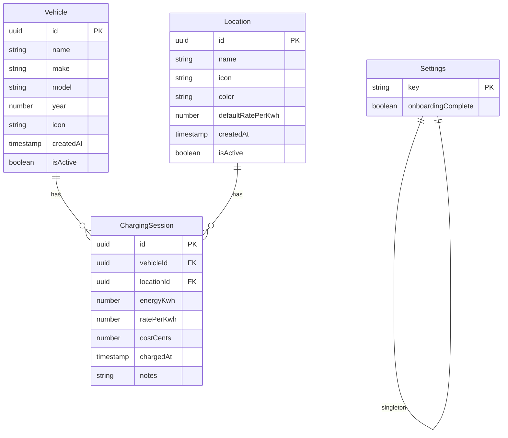
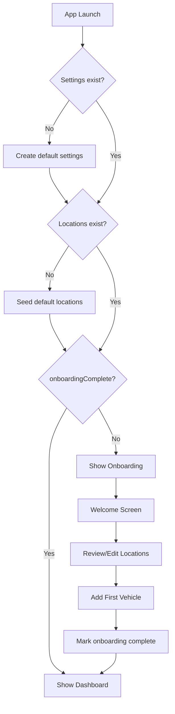
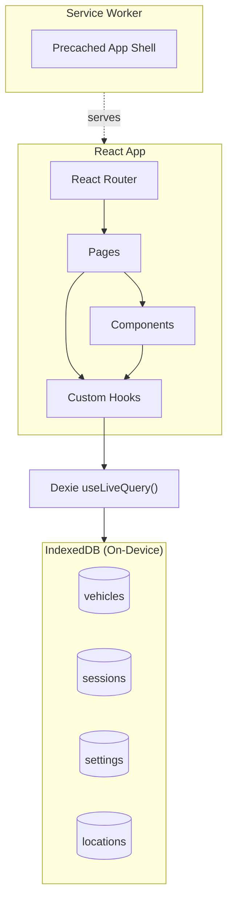

# EV Charge Tracker - Technical Architecture v3

> **Implementation Status**: All pages implemented. Database schema, hooks, providers, contexts, onboarding, dashboard, session management, vehicle management, settings, and theme support are all fully functional. Remaining: Recharts implementation, PWA icons, service worker update notification.

## Overview

A fully offline PWA for tracking EV charging sessions. Designed to function as a native-like app without app store distribution, with all data stored locally on-device.

## Technology Stack

### Core

- **Vite** - Build tool and dev server
- **React 19** - UI framework
- **TypeScript** - Type safety
- **Dexie.js** - IndexedDB wrapper with React hooks
- **Vite PWA Plugin** - Service worker generation

### UI & Styling

- **Tailwind CSS v4** - Utility-first CSS framework (bundled via `@tailwindcss/vite` plugin)

### Additional

- **Lucide React** - Tree-shakeable SVG icon components
- **Recharts** - Chart components (installed, not yet used)
- **React Router v7** - Client-side routing
- **date-fns** - Date utilities
- **Immer** - Immutable state updates (via `useImmerState` hook)
- **clsx** - Conditional className utility

## Architecture Principles

### Offline-First Design

```
NO_NETWORK_REQUIRED:
  - All features work without internet connection
  - No backend API, no cloud sync
  - Data never leaves the device
  - Network only needed for initial app download/updates

STORAGE_STRATEGY:
  - IndexedDB for all persistent data
  - Request persistent storage to survive browser cleanup
  - Warn user if storage quota is low
```

### PWA as App Store Alternative

```
DISTRIBUTION:
  - Host on any static hosting (Vercel, Netlify, GitHub Pages)
  - Users install directly from browser
  - Auto-updates via service worker
  - No app store review process
  - No platform fees
```

---

## Data Model

### Entity Relationships


```mermaid
erDiagram
    Vehicle ||--o{ ChargingSession : has
    Location ||--o{ ChargingSession : has
    Settings ||--|| Settings : singleton

    Vehicle {
        uuid id PK
        string name
        string make
        string model
        number year
        string icon
        timestamp createdAt
        boolean isActive
    }

    Location {
        uuid id PK
        string name
        string icon
        string color
        number defaultRatePerKwh
        timestamp createdAt
        boolean isActive
    }

    ChargingSession {
        uuid id PK
        uuid vehicleId FK
        uuid locationId FK
        number energyKwh
        number ratePerKwh
        number costCents
        timestamp chargedAt
        string notes
    }

    Settings {
        string key PK
        boolean onboardingComplete
    }
```

### Entities

```
Vehicle
  - id: uuid
  - name: string (user-friendly label, e.g., "Daily Driver")
  - make: string? (e.g., "Tesla")
  - model: string? (e.g., "Model 3")
  - year: number? (e.g., 2023)
  - icon: IconName (Lucide icon identifier, default "car")
  - createdAt: timestamp
  - isActive: boolean (soft delete)

ChargingSession
  - id: uuid
  - vehicleId: uuid (FK)
  - locationType: enum[HOME, WORK, OTHER, DC]
  - energyKwh: number
  - ratePerKwh: number
  - costCents: number (computed at creation, stored permanently)
  - chargedAt: timestamp
  - notes: string?

Settings
  - key: 'app-settings' (singleton)
  - defaultRates: {
      HOME: number,
      WORK: number,
      OTHER: number,
      DC: number
    }
  - onboardingComplete: boolean
```

### Default Locations

```
DEFAULT_LOCATIONS = [
  { name: 'Home',            icon: 'home',     color: 'teal',   defaultRate: 0.15 },
  { name: 'Work',            icon: 'building', color: 'slate',  defaultRate: 0.17 },
  { name: 'Other',           icon: 'map-pin',  color: 'purple', defaultRate: 0.11 },
  { name: 'DC Fast Charger', icon: 'zap',      color: 'orange', defaultRate: 0.35 }
]

// Seeded on first launch, user can add/edit/delete
// Deletion prevented if sessions reference the location
```

### Database Schema

```
STORE: vehicles
  INDEX: id (primary)
  INDEX: isActive
  INDEX: createdAt

STORE: locations
  INDEX: id (primary)
  INDEX: isActive
  INDEX: createdAt

STORE: sessions
  INDEX: id (primary)
  INDEX: vehicleId
  INDEX: locationId
  INDEX: chargedAt
  INDEX: [vehicleId, chargedAt] (compound)

STORE: settings
  INDEX: key (primary)
```

---

## First Launch & Onboarding

### App Initialization Flow


```mermaid
flowchart TD
    A[App Launch] --> B{Settings exist?}
    B -->|No| C[Create default settings]
    C --> D{Locations exist?}
    B -->|Yes| D
    D -->|No| E[Seed default locations]
    E --> F{onboardingComplete?}
    D -->|Yes| F
    F -->|No| G[Show Onboarding]
    F -->|Yes| H[Show Dashboard]

    G --> I[Welcome Screen]
    I --> J[Review/Edit Locations]
    J --> K[Add First Vehicle]
    K --> L[Mark onboarding complete]
    L --> H
```

### Default Settings Initialization

```
ON_FIRST_LAUNCH:
  CREATE settings {
    key: 'app-settings',
    onboardingComplete: false
  }

  SEED locations [
    { name: 'Home',            icon: 'home',     color: 'teal',   defaultRate: 0.15 },
    { name: 'Work',            icon: 'building', color: 'slate',  defaultRate: 0.17 },
    { name: 'Other',           icon: 'map-pin',  color: 'purple', defaultRate: 0.11 },
    { name: 'DC Fast Charger', icon: 'zap',      color: 'orange', defaultRate: 0.35 }
  ]
```

### Onboarding Screens

```
SCREEN 1: Welcome
  - App name and purpose
  - "Get Started" button

SCREEN 2: Review/Edit Locations
  - Show 4 seeded default locations
  - Allow edit (name, icon, color, rate)
  - Allow add new locations
  - Explain these can be changed later in Settings
  - "Next" button

SCREEN 3: First Vehicle
  - Required: name
  - Optional: make, model, year
  - Icon picker (Lucide icon grid)
  - "Add Vehicle" → mark onboarding complete → go to Dashboard
```

### Empty States (Post-Onboarding)

```
DASHBOARD_EMPTY:
  When: 0 sessions exist
  Show: "No charging sessions yet"
  Action: "Log your first charge" → Add Session

SESSIONS_LIST_EMPTY:
  When: 0 sessions match filters
  Show: "No sessions found"
  Action: Suggest clearing filters or adding session

VEHICLES_EMPTY:
  When: 0 active vehicles (edge case after deletion)
  Show: "Add a vehicle to start tracking"
  Action: "Add Vehicle" button
```

---

## PWA Configuration

### Installation & Icons

```
ICON_SIZES:
  - 192x192 (Android home screen)
  - 512x512 (Android splash, PWA install)
  - 180x180 (iOS touch icon)
  - 32x32, 16x16 (favicon)

ICON DESIGN:
  - All icons (including favicon) must visually match the Lucide "zap" icon used in Settings > About

MANIFEST:
  name: "EV Charge Tracker"
  short_name: "Charge Tracker"
  description: "Track your EV charging sessions offline"
  start_url: "/"
  display: "standalone"
  background_color: "#ffffff"
  theme_color: "#14b8a6" (teal-500)
  icons: [192x192 + maskable, 512x512 + maskable]
```

### Service Worker Strategy

```
PRECACHE (install time):
  - index.html
  - All JS/CSS bundles
  - App icons
  - Fonts (if any)

RUNTIME:
  - No network requests needed
  - All functionality offline

UPDATE_FLOW:
  ON new service worker detected:
    Show unobtrusive "Update available" indicator
    ON user action OR next app launch:
      Activate new service worker
      Reload app
```

### Persistent Storage

```
ON_APP_INIT:
  if navigator.storage.persist:
    granted = await navigator.storage.persist()
    if not granted:
      // Browser may still evict data under storage pressure
      // Continue normally, most browsers won't evict active PWAs

ON_SETTINGS_PAGE:
  estimate = await navigator.storage.estimate()
  Display: "{used} of {quota} used"
```

---

## High-Level Architecture


```mermaid
graph TB
    subgraph ReactApp["React App"]
        Router["React Router"]
        Pages["Pages"]
        Components["Components"]
        Hooks["Custom Hooks"]
    end

    Router --> Pages
    Pages --> Components
    Pages --> Hooks
    Components --> Hooks

    Hooks --> DexieHooks["Dexie useLiveQuery()"]
    DexieHooks --> IndexedDB

    subgraph IndexedDB["IndexedDB (On-Device)"]
        Vehicles[("vehicles")]
        Sessions[("sessions")]
        Settings[("settings")]
        Locations[("locations")]
    end

    subgraph ServiceWorker["Service Worker"]
        Cache["Precached App Shell"]
    end

    ServiceWorker -.->|serves| ReactApp
```

## Routing Structure

```
/error                         # ErrorPage (initialization failures)
/onboarding                    # Onboarding flow (3 steps, public)

Protected (RequireOnboarding guard):
/                              # Dashboard
/sessions                      # SessionsList
/sessions/add                  # SessionDetails (create)
/sessions/:id/edit             # SessionDetails (edit)
/vehicles                      # VehiclesList
/vehicles/add                  # VehicleDetails (create)
/vehicles/:id/edit             # VehicleDetails (edit)
/settings                      # Settings
/settings/locations/add        # LocationDetails (create)
/settings/locations/:id/edit   # LocationDetails (edit)
* (all others)                 # Redirect to /
```

## Data Access Pattern

### Context Providers

```
DatabaseProvider
  - Provides: db (Dexie instance)
  - Used by: All hooks and AppInitializationProvider
  - Why: Single source of truth, prevents multiple Dexie instances

ThemeProvider
  - Provides: theme, resolvedTheme ('light'|'dark'), updateTheme(theme)
  - Persists to localStorage (key: 'ev-charge-tracker-theme')
  - Listens to prefers-color-scheme; applies data-theme="dark" to <html>
  - Why: Global theme management with system preference sync

AppInitializationProvider
  - Provides: isInitialized, error
  - Uses: DatabaseProvider's db
  - Handles on mount (protected by useRef from double-init in Strict Mode):
    * Load or create default settings
    * Seed default locations (one-time)
    * Request persistent storage (navigator.storage.persist)
  - Why: Centralized initialization, runs once at app root

LayoutConfigProvider
  - Provides: title, setTitle(title)
  - Why: Allows pages to set the AppHeader title dynamically

App Structure:
  <DatabaseProvider>
    <ThemeProvider>
      <AppInitializationProvider>
        <BrowserRouter>
          <App /> (routes + LayoutConfigProvider inside Layout)
        </BrowserRouter>
      </AppInitializationProvider>
    </ThemeProvider>
  </DatabaseProvider>
```

### Custom Hooks

All data-mutation hooks use a **Result<T>** pattern — they return `Success<T> | Failure` instead of throwing.

```
useDatabase() → { db }
  // Access db from DatabaseContext; throws if used outside DatabaseProvider

useAppInitialization() → { isInitialized, error }
  // Access initialization state; throws if used outside AppInitializationProvider

useVehicles() {
  db = useDatabase()
  return {
    getVehicleList(activeOnly?) → Promise<Vehicle[]>
    getVehicle(id) → Promise<Vehicle | undefined>
    createVehicle(input) → Promise<Result<Vehicle>>
    updateVehicle(id, input) → Promise<Result<Vehicle>>
    deleteVehicle(id) → Promise<Result<void>>  // fails if vehicle has sessions
  }
}

useLocations() {
  db = useDatabase()
  return {
    getLocationList(all?) → Promise<Location[]>  // default: active only
    getLocation(id) → Promise<Location | undefined>
    createLocation(data) → Promise<Result<Location>>
    updateLocation(id, data) → Promise<Result<Location>>
    deleteLocation(id) → Promise<Result<void>>  // fails if location has sessions
  }
}

useSessions() {
  db = useDatabase()
  return {
    getSessionList(filters?) → Promise<ChargingSession[]>
    getSession(id) → Promise<ChargingSession | undefined>
    createSession(input) → Promise<Result<ChargingSession>>  // auto-calculates costCents
    updateSession(id, input) → Promise<Result<ChargingSession>>
    deleteSession(id) → Promise<Result<void>>
  }
  // filters: { vehicleId?, locationId?, dateRange? }
  // compound vehicleId+locationId filters applied in-memory
}

useSettings() {
  db = useDatabase()
  return {
    getSettings() → Promise<Settings | undefined>
    updateSettings(updates) → Promise<Result<Settings>>
    completeOnboarding() → Promise<Result<Settings>>
  }
}

useStats() {
  db = useDatabase()
  return {
    stats: SessionStats | null,
    recentSessions: SessionWithMetadata[],  // 5 most recent
    isLoading: boolean
  }
  // SessionStats: { totalKwh, totalCostCents, avgRatePerKwh, sessionCount, byLocation[] }
  // Fetches sessions, vehicles, and locations in parallel
}

useTheme() → { theme, resolvedTheme, updateTheme }
  // theme: 'light' | 'dark' | 'system'; resolvedTheme: 'light' | 'dark'

useImmerState(initialValue) → [state, setImmerState]
  // setImmerState accepts a value or an Immer draft updater function

usePageTitle(title) → { updateTitle }
  // Sets the AppHeader title for the current page

useLayoutConfig() → { title, setTitle }
  // Direct access to LayoutConfigContext
```

---

## Business Logic

### Cost Calculation

```
ON_SESSION_CREATE:
  costCents = ROUND(energyKwh × ratePerKwh × 100)
  // Stored permanently, never recalculated
  // Changing default rates does NOT affect existing sessions
```

### Vehicle Deletion

```
ON_DELETE_VEHICLE:
  sessionCount = COUNT sessions WHERE vehicleId = id

  if sessionCount > 0:
    SHOW error "Cannot delete vehicle with existing sessions"
    OFFER "Delete all sessions first?" (dangerous action)
  else:
    DELETE vehicle
```

### Location Deletion

```
ON_DELETE_LOCATION:
  sessionCount = COUNT sessions WHERE locationId = id

  if sessionCount > 0:
    SHOW error "Cannot delete location with existing sessions"
  else:
    SET location.isActive = false (soft delete)
```

### Default Rate Application

```
ON_ADD_SESSION:
  location selected → pre-fill rate from location.defaultRate
  User can override rate for this session
  "Use default rate" checkbox controls whether rate field is editable
```

---

## Development Setup

### Create Project

```bash
npm create vite@latest ev-charge-tracker -- --template react-ts
cd ev-charge-tracker

npm install dexie dexie-react-hooks
npm install react-router-dom recharts date-fns

npm install -D tailwindcss postcss autoprefixer
npx tailwindcss init -p

npm install -D vite-plugin-pwa
```

### File Structure

```
src/
  components/      # Shared UI: Button, EmptyState, Icon, SectionHeader, FullscreenLoader, RequireOnboarding
  contexts/        # Context definitions: DatabaseContext, AppInitializationContext, ThemeContext, LayoutConfigContext
  providers/       # Context providers: DatabaseProvider, AppInitializationProvider, ThemeProvider, LayoutConfigProvider
  hooks/           # useDatabase, useAppInitialization, useVehicles, useSessions, useSettings, useLocations,
                   # useStats, useTheme, useImmerState, usePageTitle, useLayoutConfig
  data/            # db.ts, data-types.ts, constants.ts, repositories.ts
  helpers/         # sessionHelpers.ts (session metadata, grouping, display name helpers)
  utilities/       # dataUtils.ts (generateId), dateUtils.ts, formatUtils.ts, resultUtils.ts, themeUtils.ts
  types/           # shared-types.ts
  pages/
    dashboard/     # Dashboard, DashboardStats, DashboardRecentSessions, DashboardStatCard
    layout/        # Layout, AppHeader, NavigationDrawer, NavigationLinks, ThemeSelector, MenuOverlay
    onboarding/    # Onboarding (3 steps + shared components)
    sessions/      # SessionsList, SessionDetails, SessionItem, SessionForm, SessionsFilter, etc.
    settings/      # Settings, LocationDetails, LocationItem, LocationForm
    vehicles/      # VehiclesList, VehicleDetails, VehicleItem, VehicleForm
    ErrorPage.tsx
public/
  icons/           # PWA icons (192, 512, etc.) - not yet generated
  favicon.ico
```

### Deployment

```
BUILD:
  Vite bundles app
  PWA plugin generates service worker + manifest

DEPLOY:
  Any free static host (Vercel, Netlify, GitHub Pages)
  Must be served over HTTPS for PWA features

USER_INSTALL:
  Visit URL in browser
  Browser shows "Install" prompt (or use menu)
  App added to home screen / app launcher
```

---

## Key Design Decisions

| Decision                   | Rationale                                            |
| -------------------------- | ---------------------------------------------------- |
| Offline-only               | Privacy, no backend costs, instant performance       |
| IndexedDB via Dexie        | Good DX, handles large datasets                      |
| Result<T> pattern          | No exceptions for expected errors, predictable flow  |
| Cost stored as cents       | Avoid floating point math issues                     |
| Cost never recalculates    | Historical accuracy (learned from Tesla's mistakes)  |
| Soft delete for vehicles   | Preserve session history integrity                   |
| Soft delete for locations  | Preserve session history integrity                   |
| Dynamic location store     | User can customize locations, rates, add new ones    |
| Lucide icons               | Tree-shakeable SVG, consistent rendering, accessible |
| Onboarding flow            | Ensure valid state before main app usage             |
| Persistent storage request | Reduce chance of data loss                           |
| Theme in localStorage      | Instant theme on load before IndexedDB is ready      |
| Immer for form state       | Ergonomic nested state updates without spread clones |
